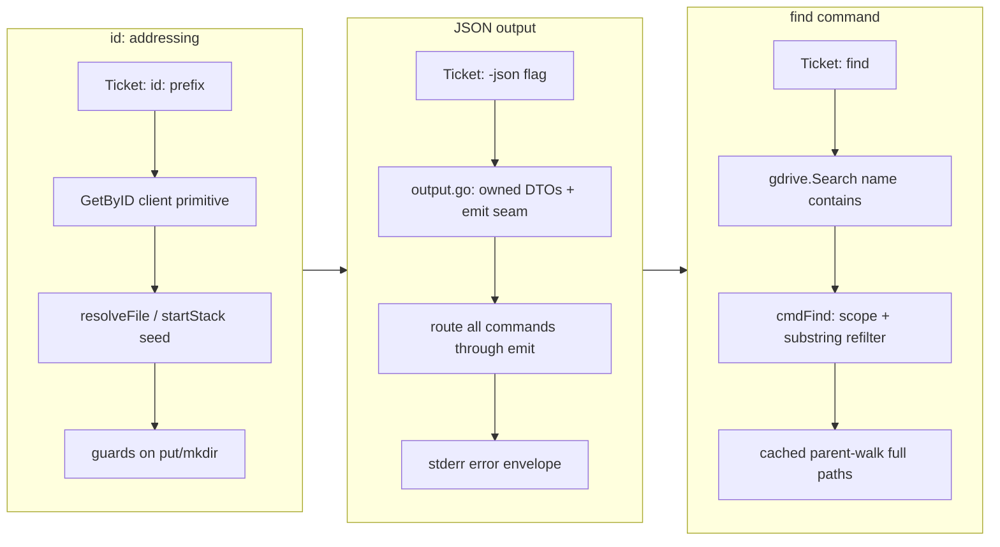

## 1. Overview

This branch extends the gdrive-ftp CLI with three composable capabilities that make it far more usable by scripts and AI agents: addressing any file or folder directly by its Google Drive ID (`id:` prefix), a global `-json` flag that turns every command's output machine-readable, and a `find` command that searches Drive by name via the native server-side query. Each feature was driven by a ticket, implemented behind the existing thin-entry-point / vendor-boundary architecture, and shipped with its README and skill documentation in the same commit.

**Highlights:**

1. `id:<DriveID>` addressing across all target-taking commands (`get`/`put`/`rm`/`ls`/`cd`/`mkdir`), resolving the long-standing inability to clean up wedged folder+file name collisions.
2. A global `-json` flag that emits compact, owned-DTO JSON (results on stdout, errors on stderr + exit 1) without leaking the Drive SDK struct shape.
3. A `find <pattern> [dir]` command using Drive's native `name contains` query, scoped to the current drive, printing full paths so results can be acted on by `id:`.

## 2. Motivation

The CLI could navigate by name and transfer files, but everything hinged on name-by-name path resolution — which left two gaps that scripts and agents repeatedly hit. First, a folder and a same-named file could coexist (a "wedged" state from an earlier bug) that the name-only CLI could neither disambiguate nor clean up; PR #2 explicitly deferred this, asking for an ID-based selector. Second, all output was human-formatted text that had to be scraped, and there was no way to search for an item whose location you didn't already know. The three features form a natural progression: `id:` gives unambiguous addressing, `-json` makes results parseable, and `find` lets you discover an item and then act on it by the `id:` the search returns — each one composing with the others rather than introducing a mode.

## 3. Changes

The branch advanced one feature at a time, each gated by a per-ticket approval: `id:` addressing landed first and introduced the `GetByID` primitive that later work reused; the `-json` flag then established an `emit` render seam and owned output DTOs; finally `find` built on both — reusing the `name contains` query layer and routing its results through the JSON seam (adding a `path` field). Documentation (README + skill) shipped inside every feature commit.

### 3-1. Accept a Google Drive file/folder ID (`id:` prefix) as a target ([372cfe5](https://github.com/qmu/gdrive-ftp/commit/372cfe5))

Added an opt-in `id:<DriveID>` token usable anywhere a remote path is expected, across `get`/`put`/`rm`/`ls`/`cd`/`mkdir`. ID detection lives in the shell resolution choke points (`resolveFile`, `startStack`/`resolveDir`) and a single new ID-keyed client method (`GetByID`); this is the unambiguous escape hatch for cleaning up wedged folder+file collisions.

### 3-2. Machine-readable JSON output via a global `-json` flag ([7436f29](https://github.com/qmu/gdrive-ftp/commit/7436f29))

Added a global `-json` flag switching every remote command to compact JSON. A new `internal/shell/output.go` holds owned DTOs and an `emit` render seam (never marshaling the vendor `drive.File`); results go to stdout (array for `ls`, object otherwise), errors to stderr as `{"error":…}` with exit 1.

### 3-3. `find` command: search Drive by name ([bd17e89](https://github.com/qmu/gdrive-ftp/commit/bd17e89))

Added `find <pattern> [dir]` using Drive's native `name contains` query at the vendor boundary, scoped to the current drive context (avoiding the discouraged `allDrives` corpus). Matches are re-filtered for true case-insensitive substring and printed as full paths (built via a cached parent-walk), reusing the `-json` seam.

## 4. Outcome

The CLI now offers a coherent discover → address → act → parse loop: `find` locates an item and returns its `id`, `id:` targets it unambiguously, and `-json` makes every step scriptable. All three features are additive and backward-compatible — default text output is unchanged, and the new surfaces are opt-in. Every change went through `go build`, `go vet`, `go test`, and `gofmt` clean, and added the first output-shape and helper unit tests the suite has had. The branch also resolved a concern deferred from PR #2 (ID-based cleanup of wedged paths).

## 5. Historical Analysis

This branch is a direct continuation of recent gdrive-ftp work. The `id:` feature is the explicit follow-up named in PR #2's put-shadowing bugfix, which identified the wedged folder+file state and recommended an ID selector. All three features build on the virtual-root / Shared-Drive scaffolding (`resolveDir`/`startStack`/`currentDriveID`, the `withDrive` corpus helper, the `Ref{ID,Name,DriveID}` type) established in earlier branches, and they consciously reused each other: `find` depends on the JSON `emit` seam, and both `find` and the wedged-path cleanup lean on the `GetByID` primitive `id:` introduced. The modeless "argument form, not a mode/flag" precedent set by `id:` carried into the `-json` decision (a composable per-invocation attribute, not a stateful toggle).

## 6. Concerns

### (carried from PR #2) put-destination logic is verified live, not unit-tested

- **Severity:** low
- **Description:** The destination decision in `cmdPut`/`cmdGet` is network-bound (`resolveDir` → live Drive calls), so it has no unit coverage. This branch widened the same gap: `gdrive.Search`, `cmdFind`, and the per-command JSON output paths are likewise untestable because no `gdrive.Client` interface/mock exists (see [bd17e89](https://github.com/qmu/gdrive-ftp/commit/bd17e89) in `internal/shell/commands.go`). Only pure helpers (`parseIDArg`, `toFileEntry`, `emit`, `nameContains`, `findPath` on root files) are covered.
- **How to Fix:** Introduce a `gdrive.Client` interface seam so `cmdPut`/`cmdGet`/`cmdFind` and the client query methods can be exercised against a mock, then add command-level output and resolution tests.

### `find` full-path reconstruction is best-effort for shared-with-me items

- **Severity:** low
- **Description:** `findPath` walks each match's `Parents[0]` up to the corpus root with a cache; for items shared *with* the user (returned by the default `corpora=user` search) whose ancestry doesn't reach the drive root, the rendered path is a best-effort partial (see [bd17e89](https://github.com/qmu/gdrive-ftp/commit/bd17e89) in `internal/shell/commands.go`). The emitted `id` is always exact, so follow-up `id:` actions are unaffected — only the displayed path may be incomplete.
- **How to Fix:** Detect when the parent-walk terminates before the corpus root and mark such paths explicitly (e.g. a `shared/` or `…/` prefix), or fetch the owning context to label them.

### JSON `size` omits genuine 0-byte files

- **Severity:** low
- **Description:** `fileEntry.Size` uses `omitempty`, so a real 0-byte binary file emits no `size` key, indistinguishable on that field alone from a folder/gdoc (see [7436f29](https://github.com/qmu/gdrive-ftp/commit/7436f29) in `internal/shell/output.go`). `isFolder` and `mimeType` still disambiguate kind, so impact is minimal.
- **How to Fix:** If exact size reporting for empty files matters, switch `Size` to `*int64` or a custom marshaler that always emits `size` for non-folders.

## 7. Successful Development Patterns

- Landing features at existing choke points rather than scattering branches — the `id:` logic plugged into the two resolution functions (`resolveFile`, `startStack`) so all six commands inherited it through one path, and `find` reused the same `withDrive` query layer. Concentrating change at a seam keeps the blast radius small and the behavior uniform.
- Building each feature so the next one reuses it — `GetByID` (from `id:`) and the `emit` seam + owned DTO (from `-json`) were both consumed by later tickets, made explicit via a `depends_on` ordering on the `find` ticket. Sequencing dependent tickets prevents building output twice.
- Translating vendor types into owned DTOs at the boundary (`toFileEntry`, never marshaling `drive.File`) kept the public JSON contract decoupled from the Google Drive SDK shape — a direct application of the vendor-neutrality policy that also made the output unit-testable with a `bytes.Buffer`.
- Grounding a design fork in the actual API rather than preference — the `find` corpus-scope decision was settled by Drive's documented guidance against `corpora=allDrives`, choosing the `withDrive`-consistent current-drive scoping instead.
- Shipping docs (README + skill) inside the same commit as each CLI-surface change, treating them as part of the public API.

## 8. Release Preparation

**Verdict**: Ready for release

### 8-1. Concerns

- None that block release. The three open items in section 6 are all low-severity (a testability-seam debt carried from PR #2, a best-effort path display for shared-with-me `find` results, and a 0-byte-size JSON edge) and none affect correctness of the default behavior.

### 8-2. Pre-release Instructions

- None — the repository has no version file or CLAUDE.md Version Management section, so no version bump applies. All changes are additive and backward-compatible.

### 8-3. Post-release Instructions

- None — no special post-release actions needed.

## 9. Notes

All three features are opt-in and backward-compatible: default text output and existing name-based paths behave exactly as before. The branch resolved one carry-over from PR #2 (ID-based cleanup of wedged paths, via `id:`) and carries one forward (the client-interface seam for unit-testing network-bound command logic).

## Deployment Evidence

- **When:** 2026-06-18T17:08:23+09:00
- **Target:** gdrive-ftp
- **Method:** other (toolchain on merge artifact)
- **Status:** pass
- **Observed:** go build/vet/test all pass and gofmt clean on the merge commit; deploy-on-merge plugin, no live endpoint
