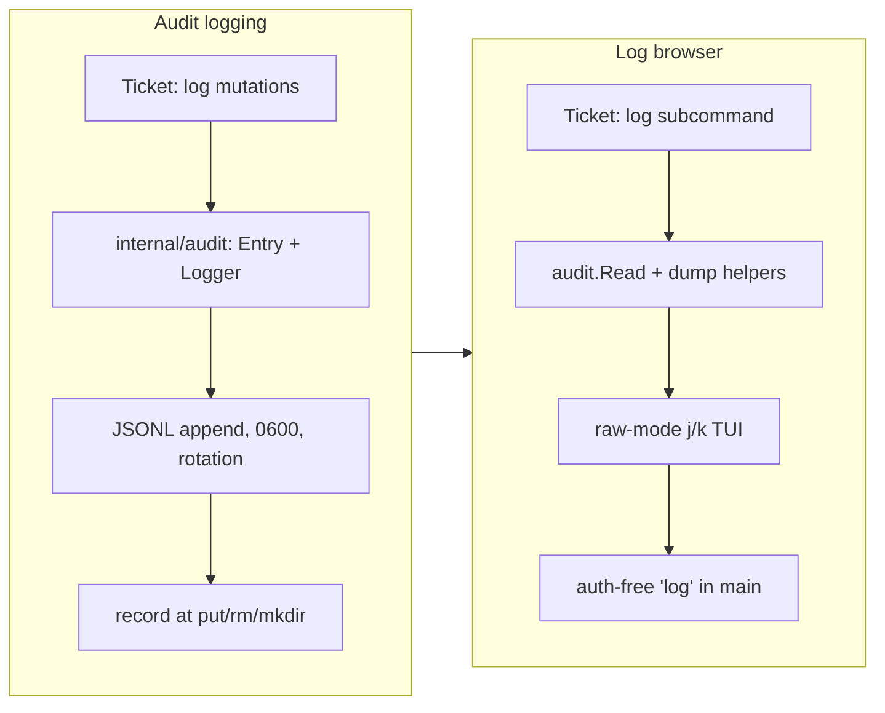

## 1. Overview

This branch gives gdrive-ftp an **audit trail**: every mutating Drive operation
(`put`, `rm`, `mkdir`) is recorded to an append-only JSON Lines log under the
config dir, and a new read-only `gdrive-ftp log` subcommand browses that history —
a small `tig`-like terminal viewer with `j`/`k` navigation, plus plain/`-json`
output for scripts and AI agents. The motivation is recovery: when an AI agent
driving the CLI changes files the user didn't intend, both can look back at exactly
what happened, and act on the recorded Drive ids.

**Highlights:**

1. Append-only `~/.config/gdrive-ftp/audit.jsonl` recording every `put`/`rm`/`mkdir` — with before/after (an overwriting `put` logs `replaced` + `priorSize`), `0600` perms, and size-based rotation.
2. A read-only `gdrive-ftp log` browser (tig-like `j`/`k`/`g`/`G`/`Enter`/`q`) built on the already-vendored `golang.org/x/term` — no new dependencies.
3. Dual reachability: the TUI is the human path; `gdrive-ftp -json log` (and the greppable JSONL file) is the agent path over the same data. A `-no-log` opt-out is provided.

## 2. Motivation

gdrive-ftp is increasingly driven by AI coding agents that can overwrite, trash, or
create files in a user's Drive — sometimes not what the user wanted — and nothing
recorded those changes, so there was no way to look back at what the CLI actually
did. The fix is an observability-and-recovery feature: record each mutation as
structured, append-only history that captures *what changed* (target, parent, and
the before/after size of an overwrite), kept as a plain local file the user owns.
Because the same trail must serve both a human reviewing a mistake and the agent
that should check its own work, it is exposed two ways — an interactive browser and
a machine-readable dump — over one schema. The constraints were deliberate and
user-set: keep it lightweight, add no third-party dependencies, and use JSON.

## 3. Changes

The work split into a foundation and a viewer. The foundation added an owned
`internal/audit` package (schema, JSONL writer, rotation), surfaced overwrite
before/after by having `gdrive.Upload` return an `UploadResult`, and recorded an
entry from each mutating command through a nil-safe best-effort seam on the Shell.
The viewer then added a reader over the rotated segments and a dependency-free
raw-mode browser, wired as an auth-free `log` subcommand that falls back to a
plain or `-json` dump when not on a terminal. Docs (README + skill) shipped in each
commit.

### 3-1. Audit log of Drive mutations (JSONL, rotated) ([c16bd97](https://github.com/qmu/gdrive-ftp/commit/c16bd97))

Added an owned `internal/audit` package and recorded every `put`/`rm`/`mkdir` as one append-only JSON line under `~/.config/gdrive-ftp/audit.jsonl` (`0600` file / `0700` dir, size-rotated 5 MB × 3). `gdrive.Upload` now returns `UploadResult{File,Replaced}` so an overwriting `put` logs `replaced`/`priorSize`. Writes are best-effort (never break the command); a `-no-log` flag disables them. No credentials or file contents are logged.

### 3-2. `log` subcommand: tig-like audit-log browser ([9629a0d](https://github.com/qmu/gdrive-ftp/commit/9629a0d))

Added `gdrive-ftp log`: a read-only raw-mode browser over the history (`j`/`k`/`g`/`G`/`Enter`/`q`) built on the already-vendored `golang.org/x/term` — no new dependencies. It is auth-free (branches before OAuth) and, when stdout is not a terminal or `-json` is given, dumps the entries as plain rows or a JSON array so scripts and agents read the same data without the TUI.

## 4. Outcome

gdrive-ftp now keeps a recoverable record of what it changed: a user or agent can
review the history in a terminal or parse it as JSON, and use the logged Drive id
to undo a mistake (re-`get` by `id:`, restore a trashed file). The feature is
additive, on by default with a `-no-log` opt-out, adds no dependencies, and is
bounded on disk by rotation. Both tickets passed `go build`/`go vet`/`go test`/
`gofmt` clean; the new `internal/audit` package carries 13 unit tests, and the
`log` dump paths were verified end-to-end against a seeded log.

## 5. Historical Analysis

The branch builds squarely on recent work. The audit `Entry` mirrors the
`actionResult` DTO and `emit` encoder conventions from the `-json` branch
(PR #3), and the recorded ids are exactly the `id:` tokens the addressing branch
(PR #3) made actionable — so the log doubles as a recovery index. The TUI reuses
the raw-mode `golang.org/x/term` pattern and the "no new third-party dependency"
rule first set by the shell tab-completion work, and the put-shadowing bug
(PR #2) is the canonical "unwanted mutation" this trail is meant to make
recoverable. The same domain-separation and vendor-neutrality discipline from
earlier branches carried through: an owned audit schema with no `drive.File`
leakage, and a feature implemented on the standard library rather than a TUI
library.

## 6. Concerns

### (carried from PR #2/#3) Network-bound command logic — including the new audit path — is not unit-tested

- **Severity:** low
- **Description:** There is still no `gdrive.Client` interface/seam, so command logic that calls the live Drive API has no unit coverage. This branch widened that surface: the mutator→audit-record path in `cmdPut`/`cmdMkdir`/`cmdRm` and the raw-mode `Browse` keypress loop are also untested (see [c16bd97](https://github.com/qmu/gdrive-ftp/commit/c16bd97) and [9629a0d](https://github.com/qmu/gdrive-ftp/commit/9629a0d) in `internal/shell/commands.go` and `internal/audit/browser.go`). Pure helpers are covered (the `internal/audit` package has 13 tests; `parseIDArg`/`toFileEntry`/`emit`/`nameContains`/`findPath`/`moveCursor`/`viewportTop` are all tested). This consolidates the duplicate carry-overs `2-put-destination-logic` and `3-carried-from-pr-2-put-destination`, which track the same debt.
- **How to Fix:** Introduce a `gdrive.Client` interface seam so the command/mutator paths can be exercised against a mock, then add command-level output, resolution, and audit-recording tests. (Two stale duplicate concern files for this item can be collapsed to one during corpus housekeeping.)

### (carried from PR #3) `find` full-path reconstruction is best-effort for shared-with-me items

- **Severity:** low
- **Description:** `findPath` walks each match's `Parents[0]` to the corpus root; for items shared *with* the user whose ancestry doesn't reach the drive root, the rendered path is a best-effort partial (`internal/shell/commands.go`). The emitted `id` is always exact, so follow-up `id:` actions are unaffected — only the displayed path may be incomplete. Unchanged this branch.
- **How to Fix:** Detect when the parent-walk stops before the corpus root and mark such paths explicitly (e.g. a `…/` prefix), or fetch the owning context to label them.

### (carried from PR #3) JSON `size` omits genuine 0-byte files

- **Severity:** low
- **Description:** `fileEntry.Size` uses `omitempty`, so a real 0-byte file emits no `size` key (`internal/shell/output.go`); `isFolder`/`mimeType` still disambiguate kind, so impact is minimal. Unchanged this branch. The audit `Entry` shares the same omitempty choice for `size`/`priorSize`.
- **How to Fix:** If exact size reporting for empty files matters, switch `Size` to `*int64` or a custom marshaler that always emits `size` for non-folders.

## 7. Successful Development Patterns

- Splitting a feature into a foundation ticket and a consumer ticket with an explicit `depends_on` kept each PR-sized and let the second build cleanly on the first — the browser reused the schema and rotation the logging ticket defined rather than re-deriving them.
- Owning the schema at a domain boundary (`internal/audit.Entry`, never marshaling `drive.File`) made the log forward-stable against the SDK and trivially unit-testable with a `bytes.Buffer`, the same vendor-neutrality move that paid off for the `-json` DTOs.
- Honoring the "no new dependencies" constraint by building the TUI on the already-vendored `golang.org/x/term` plus a single 3-byte stdin read — enough to distinguish `j` from an arrow burst from a lone Esc — kept a "nice to have" viewer from dragging in a TUI framework.
- Best-effort, never-fatal side effects: the audit write mirrors the token-cache pattern (a failed write warns on stderr and is dropped, never breaking the command or corrupting `-json` stdout) — the right shape for observability that must not become a new failure mode.
- Pushing all cursor/viewport/parse logic into pure functions and keeping the raw-mode I/O loop thin preserved testability at the one boundary that is otherwise untestable.

## 8. Release Preparation

**Verdict**: Ready for release

### 8-1. Concerns

- None that block release. The open items in section 6 are all low-severity carry-overs (a testability-seam debt, a best-effort `find` path display, and a 0-byte-size JSON edge); none affects the correctness of the new audit features, which are additive and opt-out-able.

### 8-2. Pre-release Instructions

- None — no version file or CLAUDE.md Version Management section exists; the version is bumped at ship time for a coherent release tag. All changes are additive and backward-compatible.

### 8-3. Post-release Instructions

- None — no special post-release actions needed.

## 9. Notes

Audit logging is on by default (an always-present trail is the point) and writes a
plain local file the user owns at `~/.config/gdrive-ftp/audit.jsonl` (`0600`); it
records only operation metadata and ids — never credentials or file contents — and
`-no-log` disables it. Read-only commands (`ls`/`cd`/`pwd`/`get`/`find`) are not
logged.

## Deployment Evidence

- **When:** 2026-06-18T19:56:06+09:00
- **Target:** gdrive-ftp
- **Method:** other (toolchain on merge artifact)
- **Status:** pass
- **Observed:** go build/vet/test all pass and gofmt clean on the merge commit; deploy-on-merge plugin, no live endpoint
